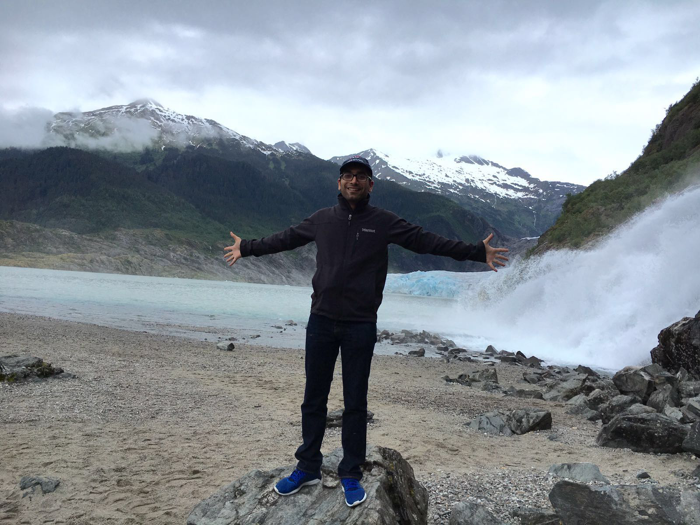

## About Me

I am a second year M.S.E candidate in Aerospace Engineering at the University of Michigan. I graduated from Purdue University with a Bachelor's in Aeronautical and Astronautical Engineering in 2019.

My hometown is New Delhi, the capital city of India. I have few hobbies like reading books on topics under science, technology, self-help, neuroscience, psychology and business. Others include watching Esports (mostly [League of Legends](https://lolesports.com/)), exercising (I follow [AthleanX](https://www.youtube.com/user/JDCav24), [10 min TABATA](https://www.youtube.com/watch?v=L1kS5I99dlM), etc.) and sketching. I have also traveled to many countries and think of myself as a global citizen.

Two things I like about nature:

Mountains!

<a href="https://www.fjordnorway.com/top-attractions/briksdalsbreen">
  <figure>
    
    <figcaption>
Briksdalsbreen, Jostel, Norway
</figcaption>
  </figure>
</a>

And glaciers!

<a href="https://www.alaska.org/detail/mendenhall-glacier-visitor-center">
  <figure>
    
    <figcaption>
Mendenhall Glacier and Lightning Mountain, Alaska, USA
</figcaption>
  </figure>
</a>

### Some Resources I like
1. [How to talk](https://www.youtube.com/watch?v=Unzc731iCUY)
2. TED Talks
   - [Meet the Dazzling Flying Machines of the Future](https://www.youtube.com/watch?v=RCXGpEmFbOw)
   - [Your Body Language May Shape Who You Are](https://www.ted.com/talks/amy_cuddy_your_body_language_may_shape_who_you_are)
3. Online reading
   - [xkcd](https://xkcd.com/)
   - [Life Hacker](https://lifehacker.com/)
