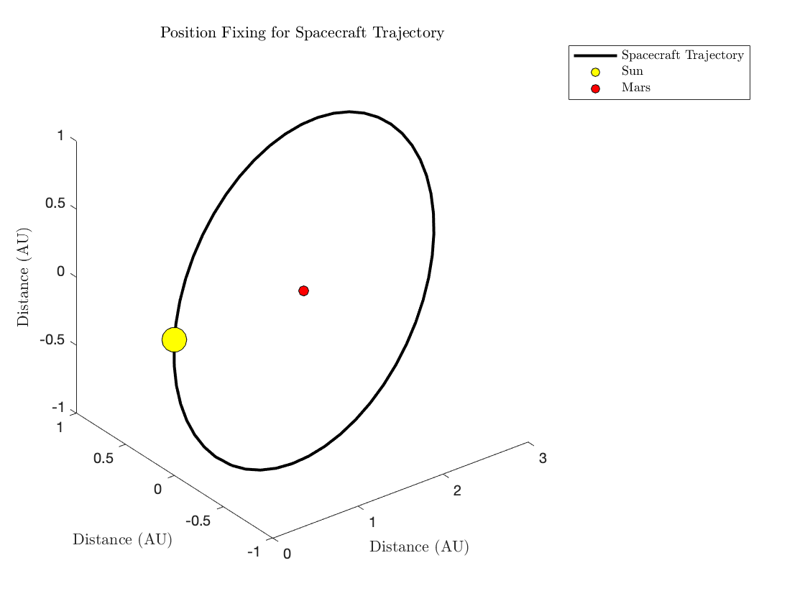

# Navigation and Guidance of Aerospace Vehicles

**Project Description:** AEROSP 584 course taught by Dr. Dennis Bernstein, Fall 2020, University of Michigan.

### Position Fixing
Position fixing can be explained through the following example, let's assume we are at a beach and we want to figure out our position. We can see three lighthouses (our references) and can determine the [bearing angles](https://en.wikipedia.org/wiki/Bearing_(navigation)) respectively. Using this information we can get a fix on our location.
 
The plot below is an example of how position fixing can be used to help estimate the location of a spacecraft. In this example the Sun and Mars act like our lighthouses and we have access to their bearing measurements relative to two stars. This helps in getting a fix on our location at every step.

<a href="images/pf_spacecraft.png">
  <figure>
    
    <figcaption>
Position Fixing for Spacecraft
</figcaption>
  </figure>
</a>

### Extended Kalman Filter
I also implemented an EKF for estimating spacecraft trajectory using reference (measurement) signals at differnt time intervals for correction. The example is shown below.
 
The extended kalman filter (EKF) is famous for its use in non-linear system. Below is another example of a spacecraft position estimation this time in normalized distance and normalized time, that can help us estimate the position of our spacecraft. If you observe closely you can see that with the increase in sampling time of measurements, i.e, the higher the time interval before correction step takes place, the larger the deviation from reference trajectory.

<a href="images/ekf.png">
  <figure>
    
    <figcaption>
Extended Kalman Filter for Spacecraft Position Estimation
</figcaption>
  </figure>
</a>

### Pursuit-Evasion Games
One of the applications of guidance and navigation can be found in pursuit-evasion. Using different guidance laws like direct pursuit, proportional pursuit, and constant bearing pursuit I was able to study the various ways in which a vehicle could reach its target. Below is one example of proportional guidance on the same. Here P is the pursuer and E is the evader. The plot shows the interaction between pursuer and evader with various proportional guidance laws. 

<a href="images/pp.png">
  <figure>
    
    <figcaption>
An Example of proportional pursuit with varying values
</figcaption>
  </figure>
</a>

