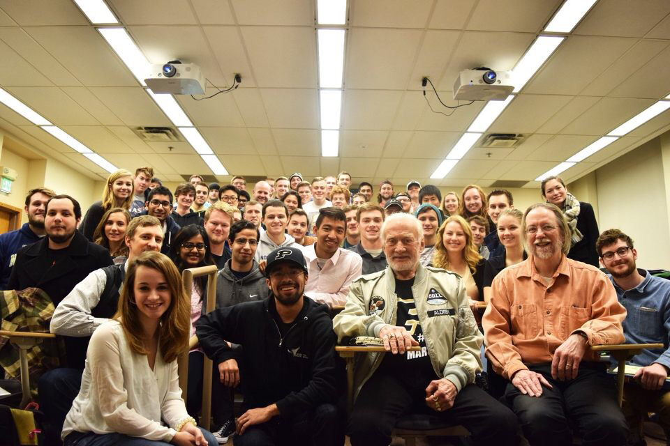

## Hello there!

Welcome to my website!  
You can access my [Updated resume](/pdf/SiddhantTandon_updated_resume_Dec1.pdf).
  
Quick links: [About Me](about), [Projects](#projects), [Skills](#skills), [Leadership](#leadership-experience)

To learn more about how I came up with my logo, click [here](logo).

---
## Projects

I have listed a few projects from my graduate and undergraduate experiences.

---
[Multi Agent Control](aerosp_740_panagou)[Control lyapunov functions, SW-MSR filter]
<!-- -->

---
[Navigation and Guidance](aerosp_584_pb)[position fixing, Kalman filter, pursuit-evasion games]

---

[Specialized Terrestrial Rotorcraft Explorer](spectre)[Airfoil design, mission design, rotorcraft design]<em> **published**</em>
<!--  -->

---
Udacity
  - [Machine Learning Engineer Nanodegree](https://github.com/SiddhantTandon/dog-project-udacity)[Supervised Learning, Unsupervised Learning, Deep Learning]
  - [Flying Car and Autonomous Flight Engineer Nanodegree](https://github.com/SiddhantTandon/Udacity_FlyingAutonomousCar)[Flight Controls, Kalman Filters, A* search]
  - [Deep Reinforcement Learning Nanodegree](https://github.com/SiddhantTandon/DRLND)[DDPG, Actor-Critic, PPO]
  - [Sensor Fusion Engineer Nanodegree (current)](https://www.udacity.com/course/sensor-fusion-engineer-nanodegree--nd313)[LiDAR, Camera, Point Cloud Data, C++]
  - [Robotics Software Engineer Nanodegree (current)](https://www.udacity.com/course/robotics-software-engineer--nd209)[ROS, C++, Path Planning]
  - [Self Driving Car Engineer Nanodegree (current)](https://www.udacity.com/course/self-driving-car-engineer-nanodegree--nd013)[Computer Vision, C++, machine learning]
<!--  -->

---

### Others

- [SpaceX One Million People Case Study](others_spacex)
  
- [EPICS Aeronautical Astronautical Engineering Education](others_epics)

---
<!-- Beginning of skills section -->
<head>

</head>

<body>

  <h1>Skill Set</h1>
  

  

  

  

  

  

  

  

</body>

<!-- end of skills section -->

---
## Leadership Experience

- Vice President, Aeronautical and Astronautical Engineering Student Advisory Council, 2019
- Project Manager, [SPECTRE](), 2018
- Controls Lead, [SPECTRE](), 2018
- Science Lead, [SPECTRE](), 2017

---
## Publications
---

---
## Courses
---
#### Graduate Courses
---

- Multi-Agent Control
- Visual Navigation for Aerospace Vehicles
- Linear systems
- Non-Linear systems
- Trajectory Optimization
- Navigation and Guidance of Aerospace Vehicles

---
#### Undergraduate Courses

---

---
<!--[testing](testing) -->
---
<!--
Page template forked from <a href="https://github.com/evanca/quick-portfolio">evanca</a>
 -->
<!-- Remove above link if you don't want to attibute -->
