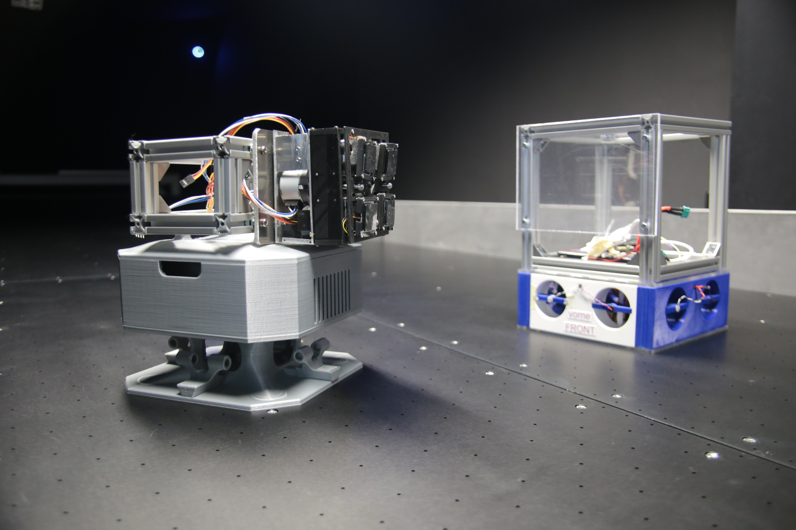
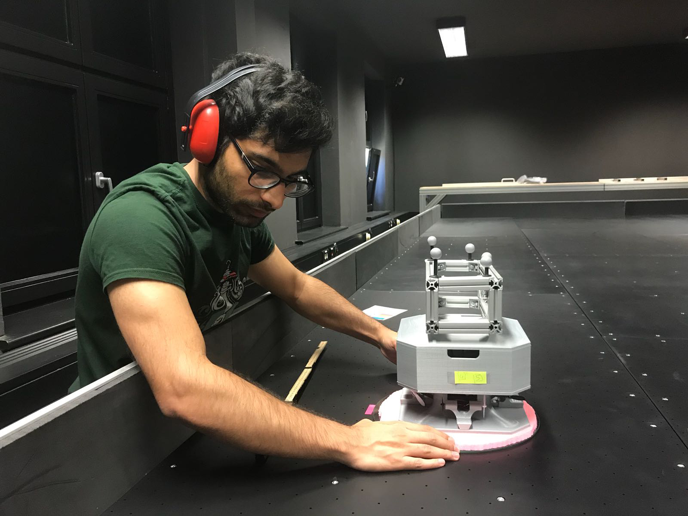

# Institute of Space Systems, Technical University of Braunschweig, Germany

As a junior at Purdue University, I got an opportunity to intern as an undergraduate researcher at the [Institute of Space Systems](), at the Technical Unviversity of Braunschweig during summer of 2018. I was primarly working under Dipl.-Ing M. Khalil Ben Larbi, a research scientist at the institute.

<a href="images/mockups.png">
  <figure>
    
    <figcaption>
Different satellite-mockups at the Institute of Space Systems
</figcaption>
  </figure>
</a>

<a href="images/at_braunschweig.png">
  <figure>
    
    <figcaption>
Testing mock-satellite operations on an air-bearing table
</figcaption>
  </figure>
</a>

Initially my task was to operate mock-satellites on an air-bearing table, then we started noticing problems in position estimates of the mock-satellites which would drive them away from desired path in an unstable motion. After various attempts, I decided to check the entire setup of the air-bearing tables, installation of the motion-sensing cameras and the operation of the mock-satellites. I had to develop testing procedures for each of the components to help me determine the root cause of the unstable motion.

<a href="images/CleanRoom.png">
  <figure>
    
    <figcaption>
Test setup inside the clean room at the Insitute of Space Systems
</figcaption>
  </figure>
</a>

<a href="images/ThrustSensorSetup.png">
  <figure>
    
    <figcaption>
Thrust Sensor Setup
</figcaption>
  </figure>
</a>

It turned out that the mock-satellites were installed with incorrect orientation of thruster-fans, used for generating thrust, and that they would lose thrust output with time, due to motors heating up. We were able to fix the problem and during the last few weeks of my internship I helped the lab develop a kalman filter for close-proximity operations of the mock-satellites.

To know more please contact me!

Similar projects: [SASSI2](cubesat)
