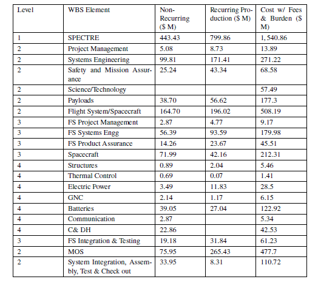
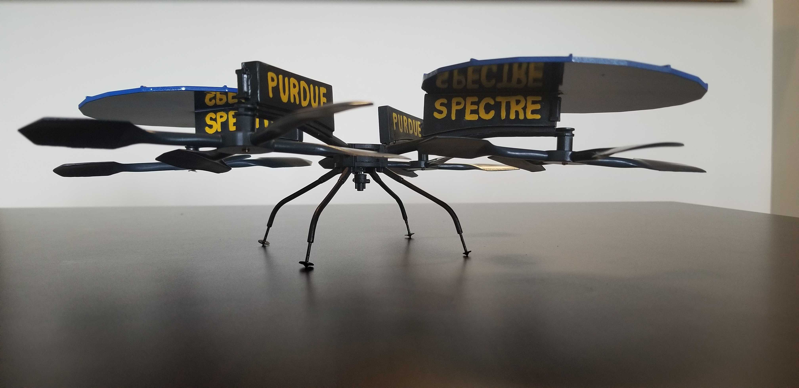

# Specialized Terrrestrial Rotorcraft Explorer

**Project Description:** A 3-year student-run project on conceptual design of a rotorcraft vehicle designed to conduct aerial spectroscopic surveys of Mars' surface.

### Science Lead
When the project started, we wanted to work with aerial vehicles designed for operations for Mars. To assist the team, I led the initial development of science and mission objectives that helped to define our requirements and thus the design of the aerial vehicle. I worked with Dr. Horgan from the EAPS department at Purdue University to develop the science objectives which eventually got compiled under the Science Traceability Matrix as shown in the image below.

<a href="images/STM.png">
  <figure>
    
    <figcaption>
Science Traceability Matrix
</figcaption>
  </figure>
</a>

As we defined our system requirements from the mission and science objectives, we were able to outline a design for the conceptual mission to Mars. The completed design is shown below. It involves four rotorcrafts (quadcopters which are homogenous in design and payload) and a rover (which is used for communications and battery charging for rotorcrafts).

<a href="images/mission1.png">
  <figure>
    
    <figcaption>
Top view of packaging
</figcaption>
  </figure>
</a>

<a href="images/mission2.png">
  <figure>
    
    <figcaption>
Side view of packaging
</figcaption>
  </figure>
</a>

<a href="images/mission3.png">
  <figure>
    
    <figcaption>
Deployment
</figcaption>
  </figure>
</a>

We designed the 2 quadcopters to operate as 'scouts', which will take low resolution images of the surface and send back to Earth through the rover. Then once the scientists identify interesting areas they want to inspect, the remaining 2 quadcopters called 'cavalry' will take high resolution spectroscopic images of those areas, while the scouts keep surveying the area ahead.

### Controls Lead

Soon after we defined our objectives, in 2018 we organized several small teams to research and develop systems as needed per the requirements we agreed upon. I lead the Controls group with 5 other sophomore students under my supervision to test and demonstrate navigation algorithms on Crazyflie 2.0 (image below.)

<a href="https://www.bitcraze.io/products/old-products/crazyflie-2-0/">
  <figure>
    
    <figcaption>
Crazyflie 2.0
</figcaption>
  </figure>
</a>

We also developed ways to calculate power consumption based on reference values from off the shelf products used in industry. This eventually helped the team develop a power budget which is shown below.

<a href="images/Power_Budget_Plot.PNG">
  <figure>
    
    <figcaption>
Power Budget Plot for the Quadcopters
</figcaption>
  </figure>
</a>

### Project Manager

As project manager in late 2018, my responsibilites had increased as we were close the end of our project timeline, with a major presentation (Critical Design Review) scheduled for the end of the year. I was the managing the project with 40 senior students on the team. I was able to guide the team and make decisions that helped us successfully pass the critical design review, the presentation can be found [here](pdf/CDR.pdf).

One of the major tasks I had to achieve as a project manager was to use NASA's Project Cost Estimation Capability (PCEC) tool, to generate a cost budget for the conceptual mission. This was of interest to our sponsors, Lockheed Martin, Boeing and Aeronautics and Astronautics Department, since it would represent a complete study of the mission. Below is the table which I compiled using the PCEC tool.

<a href="images/cost.PNG">
  <figure>
    
    <figcaption>
SPECTRE Budget breakdown (without Reserves)
</figcaption>
  </figure>
</a>

### Presenting at AIAA SciTech 2020 Forum

After passing the CDR, a few core members, including me stayed on the project to create prototypes and conduct experiments through which we can publish our results. I got a chance to present at the AIAA Student Region III Conference, which we won in April 2019. For achieving first place, I also git invited to present at the AIAA SciTech 2020 Forum. You can find the conferece proceeding [here](https://arc.aiaa.org/doi/10.2514/6.2020-0147).

<a href="images/3d_printed.jpg">
  <figure>
    
    <figcaption>
3D Printed model of the quadcopter
</figcaption>
  </figure>
</a>

The video below is the experiment we conducted on the airfoil design we came up with using the system requirements and power budget (combination of 2-3 NACA airfoils and modifications). We then used FEA and CFD analysis on the airfoil to test its efficiency through simulations. Lastly, we fabricated the design using aluminum and tested it for comparison.

<figure class="video_container">
  <iframe src="https://www.youtube.com/embed/Oui9f6FYo2g" frameborder="0" allowfullscreen="true"> </iframe>
</figure>

The result in the end, as you can hear my friend excitingly shout 'it survives!'
