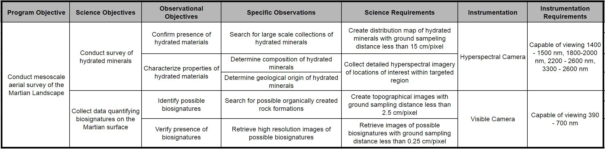
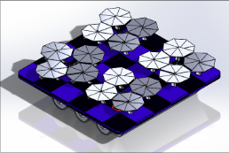
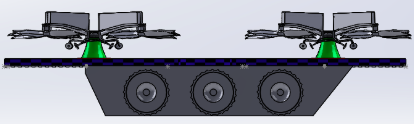
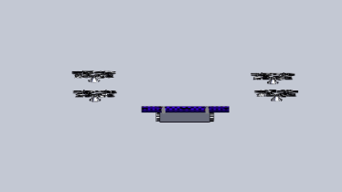
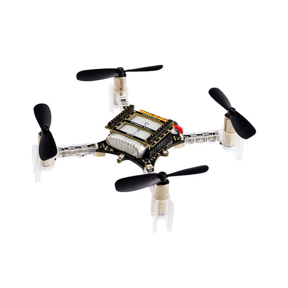
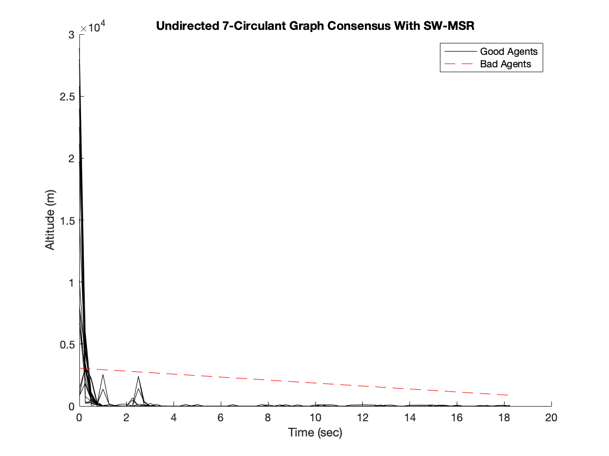

# Specialized Terrrestrial Rotorcraft Explorer

**Project Description:** Conceptual design of a rotorcraft vehicle designed to conduct aerial spectroscopic surveys of Mars' surface.

### Science Lead, 2017
When the project started, we wanted to work with aerial vehicles designed for operations for Mars. To assist the team, I led the initial development of science and mission objectives that helped to define our requirements and thus the design of the aerial vehicle. I worked with Dr. Horgan from the EAPS department at Purdue University to develop the science objectives which eventually got compiled under the Science Traceability Matrix as shown in the image below.

<a href="images/STM.png">
  <figure>
    
    <figcaption>
Science Traceability Matrix
</figcaption>
  </figure>
</a>

As we defined our system requirements from the mission and science objectives, we were able to outline a design for the conceptual mission to Mars. The completed design is shown below. It involves four rotorcrafts (quadcopters which are homogenous in design and payload) and a rover (which is used for communications and battery charging for rotorcrafts).

<a href="images/mission1.png">
  <figure>
    
    <figcaption>
Top view of packaging
</figcaption>
  </figure>
</a>

<a href="images/mission2.png">
  <figure>
    
    <figcaption>
Side view of packaging
</figcaption>
  </figure>
</a>

<a href="images/mission3.png">
  <figure>
    
    <figcaption>
Deployment
</figcaption>
  </figure>
</a>

### Controls Lead, 2018

Soon after we defined our objectives, we organized several small teams to research and develop systems as needed per the requirements we agreed upon. I lead the Controls group with 5 other sophomore students under my supervision to test and demonstrate navigation algorithms on Crazyflie 2.0 (image below.)

<a href="https://www.bitcraze.io/products/old-products/crazyflie-2-0/">
  <figure>
    
    <figcaption>
Crazyflie 2.o
</figcaption>
  </figure>
</a>

We also developed ways to calculate power consumption based on reference values from off the shelf products used in industry. This eventually helped the team develop a power budget which is shown below.

<a href="images/Power_Budget_Plot.PNG">
  <figure>
    
    <figcaption>
Power Budget Plot for the Quadcopters
</figcaption>
  </figure>
</a>

### Project Manager, 2018

<a href="images/sw_wmsr.png">
  <figure>
    
    <figcaption>
K-circulant graph with SW-MSR filtering
</figcaption>
  </figure>
</a>

### Presenting at AIAA SciTech 2020 Forum
